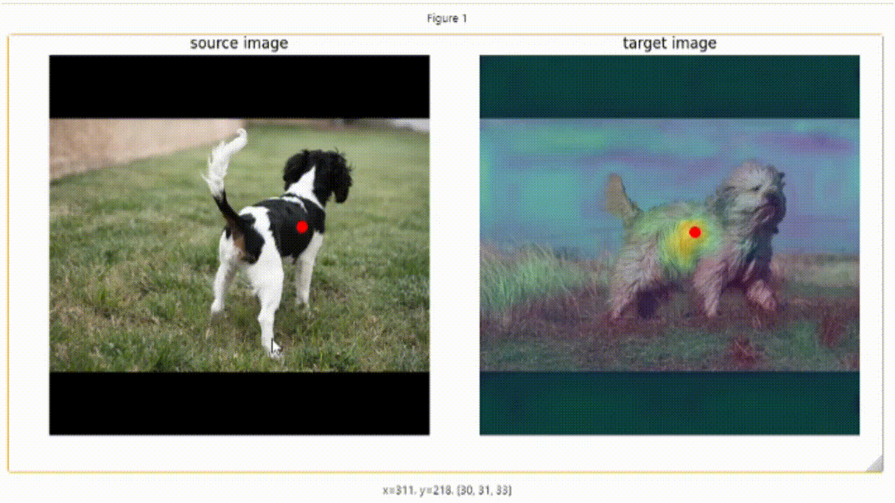
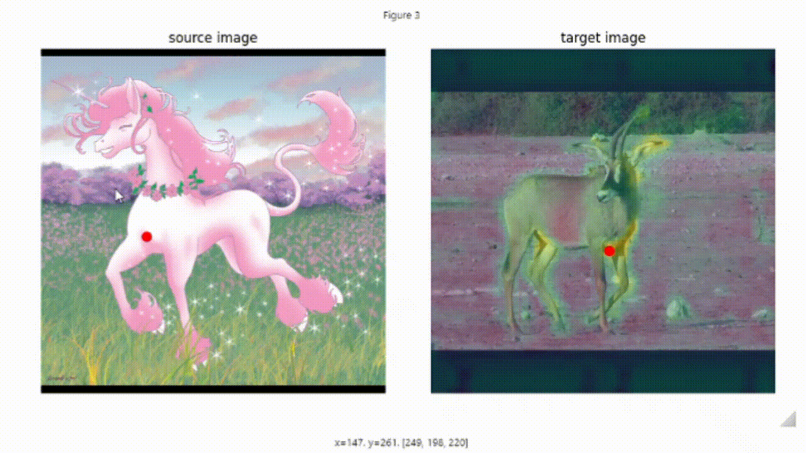

# Telling Left from Right: Identifying Geometry-Aware Semantic Correspondence

[](https://paperswithcode.com/sota/semantic-correspondence-on-spair-71k?p=telling-left-from-right-identifying-geometry)
[](https://paperswithcode.com/sota/semantic-correspondence-on-pf-pascal?p=telling-left-from-right-identifying-geometry)

**Telling Left from Right** identifies the problem of *geometry-aware semantic correspondence* and analyzes the geometric understanding of the pretrained features of foundation models, i.e., Stable Diffusion and DINOv2. We propose several techniques to improve it with a lightweight post-processor and achieve state-of-the-art performance on multiple benchmarks, e.g., **85.6** PCK@0.10 at SPair-71k. We also introduce a large-scale and challenging *semantic correspondence benchmark* based on AP-10k dataset, for both pretraining and evaluation.

This repository is the official implementation of the paper:

[**Telling Left from Right: Identifying Geometry-Aware Semantic Correspondence**](https://arxiv.org/abs/2311.17034)
[*Junyi Zhang*](https://junyi42.github.io/),
[*Charles Herrmann*](https://scholar.google.com/citations?user=LQvi5XAAAAAJ),
[*Junhwa Hur*](https://hurjunhwa.github.io/),
[*Eric Chen*](https://ezrc2.github.io/),
[*Varun Jampani*](https://varunjampani.github.io/),
[*Deqing Sun**](https://deqings.github.io/),
[*Ming-Hsuan Yang**](https://faculty.ucmerced.edu/mhyang/)
CVPR, 2024. [**[Project Page]**](https://telling-left-from-right.github.io) [**[Paper]**](https://telling-left-from-right.github.io/files/Telling_Left_from_Right_cr.pdf)


- [Telling Left from Right: Identifying Geometry-Aware Semantic Correspondence](#telling-left-from-right-identifying-geometry-aware-semantic-correspondence)
  - [Environment Setup](#environment-setup)
  - [Get Started](#get-started)
    - [Prepare the data](#prepare-the-data)
    - [Pre-extract the feature maps](#pre-extract-the-feature-maps)
    - [(Optional) Pre-extract the instance masks](#optional-pre-extract-the-instance-masks)
  - [Demo (Quick Start)](#demo)
    - [Extrating/Visualization the post-processed features](#extratingvisualization-the-post-processed-features)
    - [Global pose awareness analysis (Paper Sec. 3.4)](#global-pose-awareness-analysis-paper-sec-34)
  - [Training/Evaluation](#trainingevaluation)
    - [(Pre-)Training on the AP-10k dataset](#pre-training-on-the-ap-10k-dataset)
    - [Training on the SPair-71k dataset (with pretrained weight)](#training-on-the-spair-71k-dataset-with-pretrained-weight)
    - [Training on the PF-Pascal dataset (with pretrained weight)](#training-on-the-pf-pascal-dataset-with-pretrained-weight)
  - [Inference](#inference)
    - [Inference in the unsupervised setting](#inference-in-the-unsupervised-setting)
    - [Inference in the supervised setting](#inference-in-the-supervised-setting)
  - [Citation](#citation)
  - [Acknowledgement](#acknowledgement)


## Environment Setup

To install the required dependencies, use the following commands:

```bash
conda create -n geo-aware python=3.9
conda activate geo-aware
conda install pytorch=1.13.1 torchvision=0.14.1 pytorch-cuda=11.6 -c pytorch -c nvidia
conda install -c "nvidia/label/cuda-11.6.1" libcusolver-dev
git clone git@github.com:Junyi42/GeoAware-SC.git 
cd GeoAware-SC
pip install -e .
```

PS: There are some common issues when installing Mask2Former. You might find [this issue](https://github.com/Junyi42/sd-dino/issues/11) helpful if you encounter any problems.

(Optional) You may want to install [xformers](https://github.com/facebookresearch/xformers) for efficient transformer implementation (which can significantly reduce the VRAM consumpution):

```
pip install xformers==0.0.16
```

(Optional) You may also want to install [SAM](https://github.com/facebookresearch/segment-anything) to extract the instance masks for adaptive pose alignment technique:

```
pip install git+https://github.com/facebookresearch/segment-anything.git
wget https://dl.fbaipublicfiles.com/segment_anything/sam_vit_h_4b8939.pth
```

## Get Started

### Prepare the data

We provide the scripts to download the datasets in the `data` folder. To download specific datasets, use the following commands:

* SPair-71k: 
```bash
bash data/prepare_spair.sh
```
* PF-Pascal: 
```bash
bash data/prepare_pfpascal.sh
```
* AP-10k:

First, download the [original dataset](https://github.com/AlexTheBad/AP-10K) with the following command:
```bash
bash data/prepare_ap10k.sh
```
Then, you could preprocess the dataset to get the correspondence benchmark by running the notebook [prepare_ap10k.ipynb](prepare_ap10k.ipynb).

We also provide sample visualizations of the benchmark in the last cell of the notebook.

### Pre-extract the feature maps

To enable efficient training and evaluation, we pre-extract the feature maps of the datasets. (Note this step is not necessary if you only want to run the demo.)
To do so, run the following commands:

* SPair-71k: 
```bash
python preprocess_map.py ./data/SPair-71k/JPEGImages
```

Substitute the path `./data/SPair-71k/JPEGImages` with `./data/PF-Pascal/JPEGImages` or `./data/AP-10k/JPEGImages` for the PF-Pascal and AP-10k datasets, respectively.

For the SPair-71k dataset, it takes roughly 2 hours to extract the feature maps (for both the original and flipped images) on a single RTX 3090 GPU, and consumes around 90GB of disk space. 

### (Optional) Pre-extract the instance masks

For the default adaptive pose alignment method which requires the source instance mask, we also pre-extract the masks of the dataset for efficiency. To do so, run the following commands:

* SPair-71k: 
```bash
python preprocess_mask_sam.py ./data/SPair-71k/JPEGImages
```

## Demo

### Extrating/Visualization the post-processed features

We provide the implementation of extracting and visualizing the post-processed features (with an interactive demo!) in the [get_processed_feat.ipynb](get_processed_feat.ipynb) file. It includes example image pairs from both **dataset images** and **your own images**.

<table>
    <tr>
        <td></td>
        <td></td>
    </tr>
</table>

Extratcing the post-processed features could be as simple as running the following script:

```python
import torch
import torch.nn.functional as F
from PIL import Image
from utils.utils_correspondence import resize
from model_utils.extractor_sd import load_model, process_features_and_mask
from model_utils.extractor_dino import ViTExtractor
from model_utils.projection_network import AggregationNetwork

# load the pretrained weights
num_patches = 60
sd_model, sd_aug = load_model(diffusion_ver='v1-5', image_size=num_patches*16, num_timesteps=50)
extractor_vit = ViTExtractor('dinov2_vitb14', stride=14, device='cuda')
aggre_net = AggregationNetwork(feature_dims=[640,1280,1280,768], projection_dim=768, device='cuda')
aggre_net.load_pretrained_weights(torch.load('results_spair_cvpr/best_856.PTH'))


def get_processed_features(sd_model, sd_aug, aggre_net, extractor_vit, num_patches, img):
    # extract stable diffusion features
    img_sd_input = resize(img, target_res=num_patches*16, resize=True, to_pil=True)
    features_sd = process_features_and_mask(sd_model, sd_aug, img_sd_input, mask=False, raw=True)
    del features_sd['s2']

    # extract dinov2 features
    img_dino_input = resize(img, target_res=num_patches*14, resize=True, to_pil=True)
    img_batch = (extractor_vit.preprocess_pil(img_dino_input)).cuda()
    features_dino = extractor_vit.extract_descriptors(img_batch, layer=11, facet='token')
    features_dino = features_dino.permute(0, 1, 3, 2).reshape(1, -1, num_patches, num_patches)

    # aggregate the features and apply post-processing
    desc_gathered = torch.cat([
            features_sd['s3'],
            F.interpolate(features_sd['s4'], size=(num_patches, num_patches), mode='bilinear', align_corners=False),
            F.interpolate(features_sd['s5'], size=(num_patches, num_patches), mode='bilinear', align_corners=False),
            features_dino], dim=1)
    desc = aggre_net(desc_gathered) # 1, 768, 60, 60

    # normalize the descriptors
    norms_desc = torch.linalg.norm(desc, dim=1, keepdim=True)
    desc = desc / (norms_desc + 1e-8)
    return desc

img = Image.open('path/to/image').convert('RGB')
feat1 = get_processed_features(sd_model, sd_aug, aggre_net, extractor_vit, num_patches, img)
```

### Global pose awareness analysis (Paper Sec. 3.4)

We provide the implementation of the global pose awareness analysis in the [pose_awareness_test.py](pose_awareness_test.ipynb) file. 

You could run the following command to analyze the global pose awareness of the pretrained features:

* DINOv2 features: `python pose_awareness_test.py --ONLY_DINO 1`
* Stable Diffusion features: `python pose_awareness_test.py --FUSE_DINO 0`
* Fused features: `python pose_awareness_test.py`


## Training/Evaluation

### (Pre-)Training on the AP-10k dataset

```bash
python pck_train.py --config configs/train_ap10k.yaml
```
Some important parameters in [pck_train.py](pck_train.py) include:

* `--TRAIN_DATASET`: set to `ap10k` or `pascal` to train on the AP-10k/PF-Pascal dataset, the default training dataset is SPair-71k.
* `--EVAL_DATASET`: set to True to evaluate on the AP-10k/PF-Pascal dataset, the default evaluation dataset is SPair-71k. For the AP-10k dataset, you could also specify `--AP10K_EVAL_SUBSET` to evaluate on the different test settings (e.g., cross-species, cross-family).
* `--COMPUTE_GEOAWARE_METRICS`: set to True to evaluate on the geometry-aware semantic correspondence subset (more details in Paper Sec. 3.1).
* `--DENSE_OBJ`: set to 1 to enable the dense training objective (more details in Paper Sec. 4.2).
* `--PAIR_AUGMENT`: set to True to enable the pose-variant pair augmentation (more details in Paper Sec. 4.3).
* `--SOFT_EVAL`: set to True to enable the window soft-argmax evaluation (more details in Paper Sec. 4.4).
* `--LOAD`: the path to the pretrained weight.
* `--TOTAL_SAVE_RESULT`: number of samples to save the qualitative results, set to 0 to disable and accelerate the evaluation process.

Please refer to the [pck_train.py](pck_train.py) file for more details. You may find samples of qualitative results in the `results_ap10k` folder.

### Training on the SPair-71k dataset (with pretrained weight)

```bash
python pck_train.py --config configs/train_spair.yaml
```

Note that the `TEST_SAMPLE` is the number of sampled pairs for each category for evaluation, which is set to 20 by default. Set to `0` to use all the samples in the evaluation set.

### Training on the PF-Pascal dataset (with pretrained weight)

```bash
python pck_train.py --config configs/train_pascal.yaml
```

## Inference

### Inference in the unsupervised setting

```bash
python pck_train.py --config configs/eval_zero_shot_spair.yaml
```

Some important parameters here include:

* `--DO_EVAL`: set to True to start the evaluation process.
* `--DUMMY_NET`: set to True to use the identical post-processing network for the unsupervised setting.
* `--ADAPT_FLIP`: set to True to enable the test-time adaptive pose alignment method (more details in Paper Sec. 4.1). In default, it requires the source instance mask to align the pose. You could also bypass the use of mask by enabling `--MUTUAL_NN` to use the mutual nearest neighbor distance for the pose alignment.
* `--KPT_RESULT`: set to True to get the results under the _per keypoint_ setting (as in Tab. 2 of our paper). In default, the _per image_ result is evaluated (as in Tab. 3 of our paper). Please refer to the caption of Tab.2 for more details, and the Sec 5.2 of [DIFT paper](https://proceedings.neurips.cc/paper_files/paper/2023/file/0503f5dce343a1d06d16ba103dd52db1-Paper-Conference.pdf) for the difference of two settings.

### Inference in the supervised setting

```bash
python pck_train.py --config configs/eval_spair.yaml
```

You could also replace the `--config` with `configs/eval_pascal.yaml` or `configs/eval_ap10k.yaml` to evaluate on the PF-Pascal or AP-10k dataset.

We provide several pretrained weights to reproduce the results in the paper. You could find the pretrained weights in the `results_spair` folder.

## Citation

If you find our work useful, please cite:

```BiBTeX
@inproceedings{zhang2024telling,
  title={Telling Left from Right: Identifying Geometry-Aware Semantic Correspondence},
  author={Zhang, Junyi and Herrmann, Charles and Hur, Junhwa and Chen, Eric and Jampani, Varun and Sun, Deqing and Yang, Ming-Hsuan},
  booktitle={Proceedings of the IEEE/CVF Conference on Computer Vision and Pattern Recognition},
  year={2024}
}
```

## Acknowledgement

Our code is largely based on the following open-source projects: [A Tale of Two Features](https://github.com/Junyi42/sd-dino), [Diffusion Hyperfeatures](https://github.com/diffusion-hyperfeatures/diffusion_hyperfeatures), [DIFT](https://github.com/Tsingularity/dift), [DenseMatching](https://github.com/PruneTruong/DenseMatching), and [SFNet](https://github.com/cvlab-yonsei/SFNet). Our heartfelt gratitude goes to the developers of these resources!
